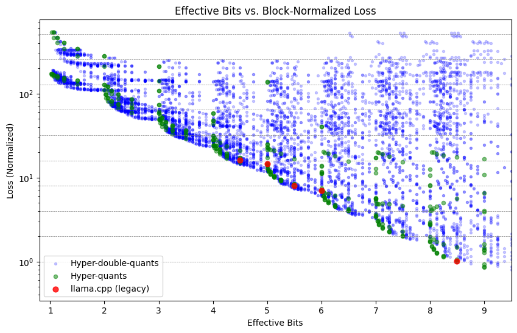
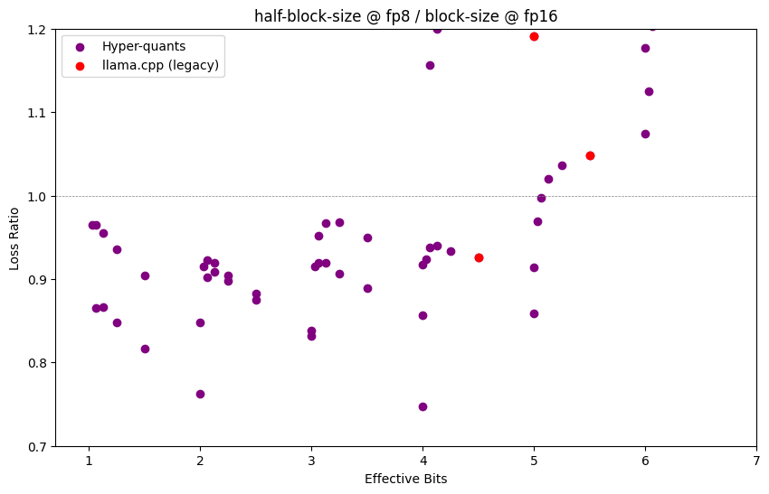
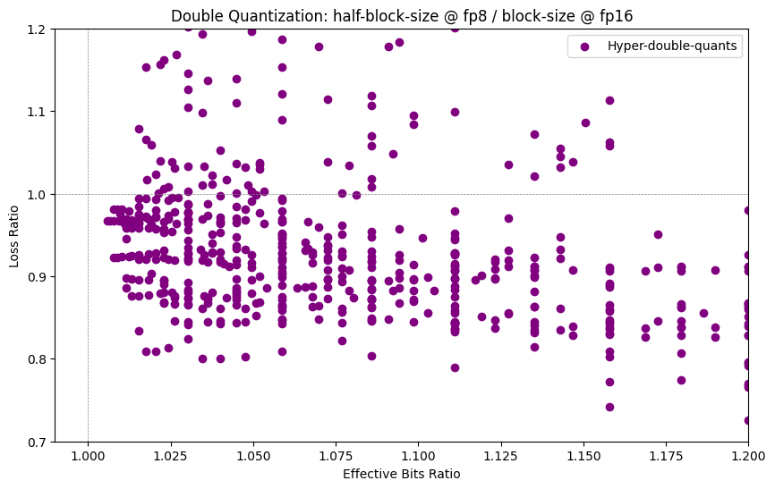

# Hyper-Quantization

Hyper-Quantization is an experimental project that builds on top pf the quantization techniques of [`llama.cpp`](https://github.com/ggerganov/llama.cpp). It explores new quantization schemes and techniques to optimize LLM inference performance while maintaining model accuracy.

---

## Quantization

Quantization reduces model size but introduces errors. The key challenge is to balance precision vs. efficiency. Llama.cpp legacy quantization (Q8_0, Q4_0/1, Q5_0/1) uses block sizes of $32$ and stores scales in `fp16`. K-quants improve on this by quantizing the scales and minimums block-constants using a super-block of size $16\times16$.  

Hyper-Quantization expands this idea further, systematically testing all block sizes, bit depths, and symmetric/asymmetric options to find the best configurations. Another key innovation is the ability to store scales in `fp8` instead of `fp16` or `bf16`, reducing memory overhead while maintaining precision.  

### 🔍 Comparing Quantization Hyper-Parameters

The figure below compares single and double quantization, showing all possible Hyper-Quant configurations (purple and green). Some Hyper-Quants outperform legacy quants (red) for a given effective bit range. These configurations are particularly valuable, as they allow models to achieve the same size but with lower loss (higher accuracy).  

  

### 🔍 FP8 in Single Quantization  

If we halve the block size, loss decreases, but the effective number of bits increases. However, if we store the scales and minimums in `fp8` instead of `fp16`, we can maintain the same effective bit count while benefiting from lower loss.  

The graph below explores this trade-off by plotting the loss ratio between a half-block-size@fp8 and a full-block-size@fp16 configuration.  

- Values below 1 indicate a net gain when switching to `fp8`.  
- Some quantization types achieve up to 25% lower loss under this transformation.  
- Q4_0, for example, reduces loss by nearly 10% simply by switching to 16-block @ fp8.  

Note: Computation is not performed at `fp8`—it still runs at `fp16`, `bf16`, or `fp32`.  

  

### 🔍 FP8 in Double Quantization  

We can also apply `fp8` to double quantization schemes. However, unlike in single quantization, we cannot simply halve the block size and maintain the same effective bit count when switching from `fp16` to `fp8`.  

Instead, in double quantization, reducing the hyper-block from $16 \times 16$ to $8 \times 8$ always increases the effective number of bits slightly.  

- In some cases, we increase the effective bits by only ~2% while reducing the loss by 20%.  
- This suggests that using smaller hyper-blocks with `fp8` scaling may provide a better trade-off in specific configurations.  

  

Further testing will explore real-world LLM inference performance.  

**Note**: K-quants are yet to be added to the graphs above. They will be crucial for comparing different configurations and evaluating the impact of using fp8.

---

## 📌 Status
This project is currently under construction. Stay tuned for updates.

TODO:
- [ ] Make TODO

## 📄 License
[MIT](./LICENSE)

---

*Inspired by `llama.cpp` and `ggml` innovations in quantization.* 
